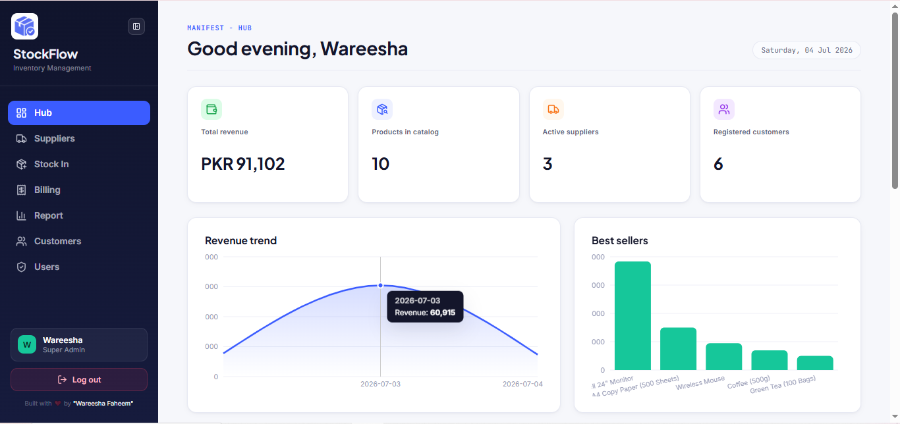
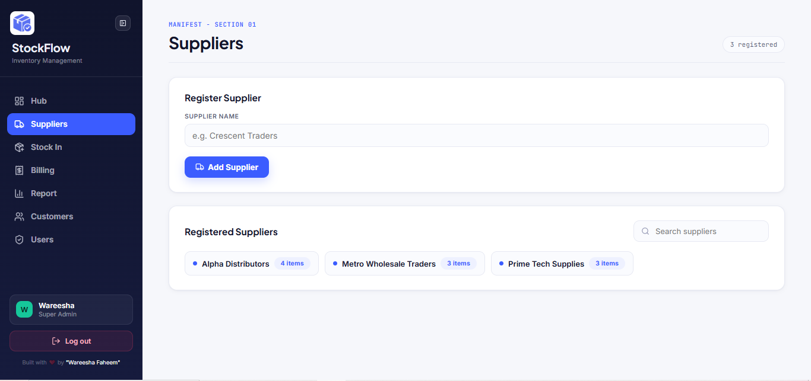
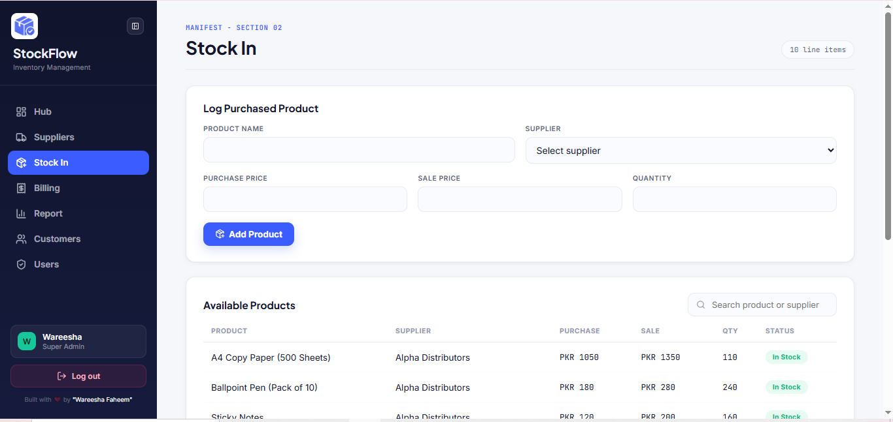
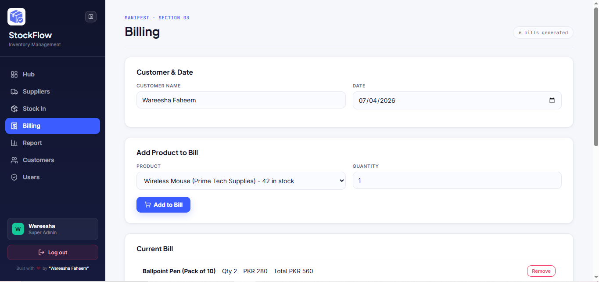
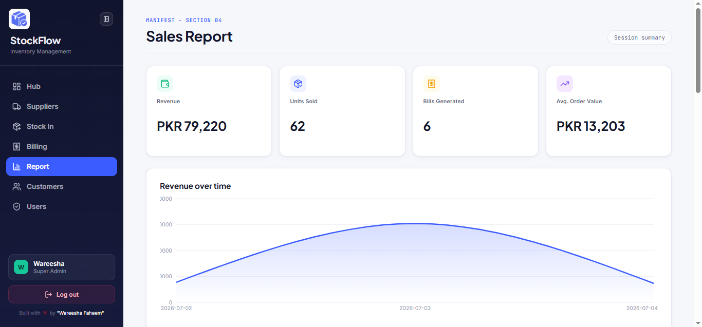

<h1 align="center">
📦 StockFlow - Inventory Management System
</h1>

<p align="center">
  <b>A modern React-based Inventory Management System for managing products, suppliers, customers, billing, and business analytics.</b>
</p>

<p align="center">
  <a href="https://stockflow-inventory-management-system.vercel.app/" target="_blank">
    
  </a>
  <a href="https://github.com/wareesha-faheem/stockflow-inventory-management-system" target="_blank">
    
  </a>
  
  
  
</p>

---

## 🌐 Live Demo

**Try it here:** https://stockflow-inventory-management-system.vercel.app/

---

## 📸 Preview

### Dashboard



### Suppliers



### Stock In



### Billing



### Reports



---

## ✨ Features

- Dashboard Analytics
- Inventory Management
- Supplier Management
- Customer Management
- Billing System
- Sales Reports
- Smart Search
- Persistent Storage
- Responsive UI

---

## 🛠 Tech Stack

| Technology | Usage |
|------------|-------|
| React.js | Frontend |
| React Router | Routing |
| Context API | Global State |
| Vite | Build Tool |
| JavaScript ES6+ | Logic |
| HTML5 | Structure |
| CSS3 | Styling |
| LocalStorage | Data Persistence |

---

## 📂 Folder Structure

```
├── src/
│   ├── assets/         # Images, icons & static assets
│   ├── components/     # Reusable UI components
│   ├── constants/      # Constant values & configuration
│   ├── contexts/       # Context API state management
│   ├── hooks/          # Custom React hooks
│   ├── utils/          # Utility/helper functions
│   ├── App.css
│   ├── App.jsx
│   ├── index.css
│   └── main.jsx
```

---

## 🚀 Getting Started

### Clone Repository

```bash
git clone https://github.com/wareesha-faheem/stockflow-inventory-management-system.git
```

### Navigate

```bash
cd stockflow-inventory-management-system
```

### Install Dependencies

```bash
npm install
```

### Run Development Server

```bash
npm run dev
```

Open

```
http://localhost:5173
```

---

## 📊 Modules

| Module | Status |
|---------|--------|
| Dashboard | ✅ |
| Authentication | ✅ |
| Products | ✅ |
| Suppliers | ✅ |
| Customers | ✅ |
| Stock In | ✅ |
| Billing | ✅ |
| Reports | ✅ |

---

## 📈 Future Improvements

- Backend Integration
- Firebase Authentication
- JWT Authentication
- Database Support
- Export Reports to PDF
- Export Excel Files
- Barcode Scanner
- Email Invoices
- Notifications
- Dark Mode

---

## 🚀 Built by

Developed with ❤️ by **Wareesha Faheem**

I'm passionate about creating modern web applications that combine clean design with efficient functionality. This project reflects my journey in React.js and frontend development.

If you like this project, don't forget to leave a ⭐!
